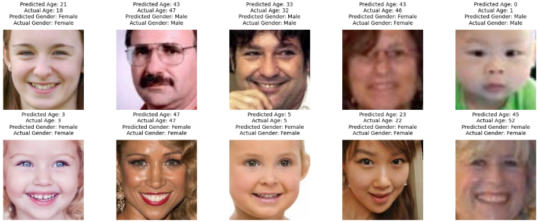

# 🧑‍🦱 Age & Gender Classification

  

## 📌 Overview
This deep learning project focuses on predicting **age** and **gender** from facial images using a convolutional neural network (CNN). The model is trained to perform **binary classification** for gender and **regression** for age estimation using the UTKFace dataset.

## 🧪 What I Did
- Preprocessed RGB facial image data  
- Built a CNN with shared layers and two outputs (age & gender)  
- Trained the model with MAE for age and binary crossentropy for gender  
- Evaluated with accuracy and error metrics on test data  

## 🛠️ Tools & Technologies
- Python  
- TensorFlow / Keras  
- Google Colab  
- NumPy, Matplotlib, Seaborn  

## 💡 Skills Demonstrated
- Deep Learning  
- CNN  
- Multi-Task Learning  
- Image Preprocessing  
- Regression & Classification  

## 🏥 Industry Application
**Healthcare / Biometrics / Demographics**

## 📈 Results
The model predicts gender with high accuracy and estimates age with low MAE.

## 🔗 Links
- [View on Kaggle](https://www.kaggle.com/code/aliamrali/age-gender-classification)
- Also available on GitHub with full source code and documentation.

## 📷 Project Summary Image

The image below visualizes sample Images, confusion matrix, and Prediction from the CT scan dataset.

  

  

  

